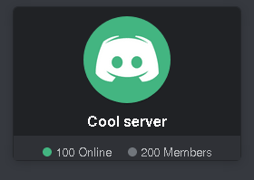

# Dream Nexus
A nexus from Yume Nikki Discord servers.


## How it works

This is a very simple discord server lister and it can be used for any other type of server. If your interested in how it works, and intend on using it. Here's a small tutorial on it. Your going to need a basic understanding of HTML, CSS and Javascript. I recommend you first look through the source before going through this. This should provide a supplementry explanation over the source.

### HTML/CSS - index.html
This list is made purely from HTML, CSS and Javascript. This part should explain how the HTML and CSS parts work.

So in order to get our nice discord-like boxes, a simple CSS called `nexus.css` is used. `nexus.css` can be called with the link tag.

	<html lang="en">
	      <head>		
		<link rel="stylesheet" type="text/css" href="nexus.css">
	      </head>
	</html>

By calling this link, our page is now ready to be stylized.
The first thing we want to build our server boxes are some basic divs.
So we add ```<div class="server">Hello!</div>```

	<!doctype html>
	<html lang="en">
	    <head>
	      <link rel="stylesheet" type="text/css" href="nexus.css">
	    </head>
	    <body>
	      <div class="server">
		Hello!
	      </div>
	    </body>	
	</html>
  
This should get you something like this:  


You can now add information into this div and it should all appear nicely in this box.

The next important part to add, is the server icon and title. This can be done with these two tags:

    <div class="server">
      
      <br>
      <b class="name">Cool server</b>
    </div>
    
The ``icon`` and ``name`` class ensure the discord-like style is kept. Heres what it should look like:


The next part is the ```<div class="info">```, this is for additional information about the server. This includes server population, invite button, notes, warnings, etc.

Now the first thing people care about, before joining the server is how active it is. Most people don't want to join a dead server. To show this information there are 3 tags:

```<div class="circle"></div>```
shows a transparent circle,

```<div class="circle on"></div>```
shows a green circle,

```<div class="circle off"></div>```
shows a grey circle,

This is useful to indicate whose online and whose offline. We can add these tags inside ```<div class="info">```, as such:

		<div class="server">
			
			<br>
			<b class="name">Cool server</b>
			<div class="info">
				<div class="circle on"></div> 
				100 Online
				<div class="circle"></div>
				<div class="circle off"></div> 
				200 Members
			</div>
		</div>
    
This results in:  


The additional ```<div class="circle"></div>``` is used as a glorified space, but to be honest a better solution can probably be found.

Now to finally add an Invite button, and some notes we use:

			<a href="https://discord.gg/JzuTbJe">
				<div class="join">Join</div>
			</a>

			<div class="notes">
				<b>Category: </b>General<br>
				<b>Notes: </b>This server is really cool<br>
			</div>
      
Which finally gets you something like this:


Now all of this, we want to create via Javascript!

### Javascript pt. 1 - The HTML part of Javascript

Now to call ``nexus.js``, we can use our ```<script>``` tag like this:

    <!doctype html>
    <html lang="en">
      <head>
        <link rel="stylesheet" type="text/css" href="nexus.css">
        <script src="nexus.js"></script>
      </head>
    </html>
    
To prepare the page for nexus.js, we need the ```<div id="list"></div>``` element. This tells ``nexus.js`` where to put the server boxes.

    <!doctype html>
    <html lang="en">
      <head>
        <link rel="stylesheet" type="text/css" href="nexus.css">
        <script src="nexus.js"></script>
      </head>
      <body>
        <div id="list"></div>
      </body>
    </html>
    
Of course, you will see nothing, but let us now call some Javascript. The ```displayServer``` function.

		<script>
			displayServer({
				invite:	"fAkEInVitE",
				name:	"Cool server",
				icon:	"./img/icon.png",
				count:	200,
				active:	100,
				notes:	"This server is really cool!",
				type:	["General", "Cool"],
				warn:	0
			});
		</script>
    
This function will automatically generate the HTML we were trying to make earlier. The ```warn``` switch allows us to change the Notes into a Warning (0 = Off, 1 = On). The source for this is quite ugly, but you can check the source if your interested. 

So now with all the HTML over, into how nexus.js actually works.

### Javascript pt. 2 - Discord API

First thing we need is a collection of server invite codes, a basic description and some notes. We'll store this information in a simple object.

    var servers = {
        'JzuTbJe': { type:["General"], notes:"A cool server" }
        'JzuTbJe': { type:["General"], notes:"Another cool server" }
    }
    
Now we want to fetch information regarding this server. Luckily discord has an API for it. Whether this is officially supported, I don't know. But it works now, so we'll stick with it. To do this we'll use an XHR request.

    function loadServer(id) {
      var req = new XMLHttpRequest();
      req.onreadystatechange = function() { 
        if (this.readyState == 4 && this.status == 200) {
          console.log(this.responseText);
        }
      }
      req.open("GET",
        "https://discordapp.com/api/v6/invites/"+id+"?with_counts=true",
         true
      ); 
      req.send(null);
    }
    
This will give a massive JSON file with heaps of information about the server in it. We're mainly concerned about: 
``code, approximate_member_count, approximate_presence_count, guild.name, guild.id``

As previously mentioned, we want to fit this data in this:

		<script>
			displayServer({
				invite:	"fAkEInVitE",
				name:	"Cool server",
				icon:	"./img/icon.png",
				count:	200,
				active:	100,
				notes:	"This server is really cool!",
				type:	["General", "Cool"],
				warn:	0
			});
		</script>
    
So lets parse this data, into the format for ``displayServer``. The server icon can be found by:
"https://cdn.discordapp.com/icons/[SERVER_ID]/[SERVER_ICON].png?size=128",

	function saveServer(json) {
		var api = JSON.parse(json);
		var info = {
			invite:	api.code,
			name:	api.guild.name,
			icon:	"https://cdn.discordapp.com/icons/"+api.guild.id+
				"/"+api.guild.icon+".png?size=128",
			count:	api.approximate_member_count,
			active:	api.approximate_presence_count,
			notes:	servers[api.code].notes,
			type:	servers[api.code].type,
			warn:	servers[api.code].warn,
		}
		displayServer(info);
	}

We could go and loop through a bunch of IDs, and display them automatically, but that could get us rate limited.

To avoid this, we're going to want a cache.

### Javascript pt. 3 - Cache

Since we're loading this into cache, we might as well order the servers from most active to least.

So here are the steps:  

	1. Get server information  
	2. Save information into cache (with expiry date)  
	3. Organize servers from most to least active  
	4. Display information  
	5. Next time we get a visitor, we show them the cached version.  

Now to save information into cache, we'll just use ```localStorage```.
```localStorage``` lets use store temporary data for the specific page.

We also want an expiry date, so we'll simply store the expiry data along with the server info.

An expiry date can be made with ```Date.now()``` which returns a timestamp.
But we don't want the timestamp to expire immediately so we'll slow it down a bit.
```Math.floor(Date.now()/1000000)```, this should slow down the timestamp enough.

We'll throw the caching part into loadServer:

	//If expiry time is different to current time
	if(localStorage.expiry != Math.floor(Date.now()/1000000)) {

		//Set expiry time to now
		localStorage.expiry = Math.floor(Date.now()/1000000);

		//Clear localStorage
		localStorage.clear();
	}

	function loadServer(id) {
		var req = new XMLHttpRequest();

		//Get the cached version
		var cache = localStorage[id];

		//If it does exist, parse the server, and stop loading
		if(cache) { saveServer(cache); return; }

		req.onreadystatechange = function() { 
			if (this.readyState == 4 && this.status == 200) {
				localStorage[id] = this.responseText;
				saveServer(this.responseText);
			}
		}
		req.open("GET",
			"https://discordapp.com/api/v6/invites/"+id+"?with_counts=true",
			 true
		); 
		req.send(null);
	}

So now we've set loadServer to check if there is a cached version.
If so it will load that version, otherwise it will delete the cache and load a new.

Now, we want to sort all the servers from the most active.
But we need to seperate the servers into their respective categories.
We don't want an extremely popular NSFW server to come to the top right?

To do this, we'll make 2 new global variables.

	var categories = {};
	var serversLoaded = 0;

This way, we can make an array for each category and sort each of them individually.
The compare function allows us to sort servers depending on their specific attributes.

e.g
	var categories = {
		General:	[ serverA, serverB ],
		NSFW:		[ serverC, serverD ]
	}

	function compare(a, b) { return a.active < b.active; }

	categories.General.sort( compare )
	categories.NSFW.sort( compare )


We want to push each server's information into these categories.
Once these categories are filled, we will display all the servers.

We'll put this part in saveServer which seems most appropriate.

	function compare(a, b) { return a.active < b.active; }

	function saveServer(json) {
		var api = JSON.parse(json);
		var info = {
			invite:	api.code,
			name:	api.guild.name,
			icon:	"https://cdn.discordapp.com/icons/"+api.guild.id+
				"/"+api.guild.icon+".png?size=128",
			count:	api.approximate_member_count,
			active:	api.approximate_presence_count,
			notes:	servers[api.code].notes,
			type:	servers[api.code].type,
			warn:	servers[api.code].warn,
		}

		//Check if this server's category exist, otherwise, create it
		if(!categorie all thes[info.type[0]])
			categories[info.type[0]] = [];

		//Push this server's information into the category
		categories[info.type[0]].push(info);

		serversLoaded += 1;

		//If serversLoaded doesn't equal the number of servers, wait
		if(serversLoaded != Object.keys(servers).length) return;

		//Otherwise, loop through each category
		for(var i in categories) {

			//Sort the category
			categories[i].sort(compare);

			//Loop through each server and display
			for(var j in categories[i]) {
				displayServer(categories[i][j]);
			}
		}
	}

And there we go. A server lister!

The actual source includes some error checking and a loading icon, but that's it!

There are plenty of parts which can be optimised, but this a simple solution to making a basic server lister.

Enjoy!